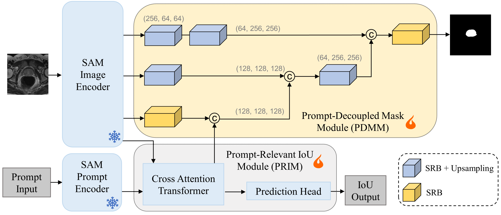

# DeSAM 
This is the official repository for DeSAM: Decoupled Segment Anything Model for Generalizable Medical Image Segmentation.


> **[DeSAM: Decoupled Segment Anything Model for Generalizable Medical Image Segmentation](https://link.springer.com/chapter/10.1007/978-3-031-72390-2_48 )**
> <br>Yifan Gao, Wei Xia, Dingdu Hu, Wenkui Wang and Xin Gao<br>
> MICCAI 2024

## Abstract
Deep learning-based medical image segmentation models often suffer from domain shift, where the models trained on a source domain do not generalize well to other unseen domains. As a prompt-driven foundation model with powerful generalization capabilities, the Segment Anything Model (SAM) shows potential for improving the cross-domain robustness of medical image segmentation. However, SAM performs significantly worse in automatic segmentation scenarios than when manually prompted, hindering its direct application to domain generalization. Upon further investigation, we discovered that the degradation in performance was related to the coupling effect of inevitable poor prompts and mask generation. To address the coupling effect, we propose the Decoupled SAM (DeSAM). DeSAM modifies SAM’s mask decoder by introducing two new modules: a prompt-relevant IoU module (PRIM) and a prompt-decoupled mask module (PDMM). PRIM predicts the IoU score and generates mask embeddings, while PDMM extracts multi-scale features from the intermediate layers of the image encoder and fuses them with the mask embeddings from PRIM to generate the final segmentation mask. This decoupled design allows DeSAM to leverage the pre-trained weights while minimizing the performance degradation caused by poor prompts. We conducted experiments on publicly available cross-site prostate and cross-modality abdominal image segmentation datasets. The results show that our DeSAM leads to a substantial performance improvement over previous state-of-the-art domain generalization methods.

## Training DeSAM on cross-site prostate dataset

### Installation 
1. Create a virtual environment `conda create -n desam python=3.10 -y` and activate it `conda activate desam`
2. Install Pytorch
3. git clone `https://github.com/yifangao112/DeSAM.git`
4. Enter the DeSAM folder `cd DeSAM` and run `pip install -r requirements.txt`

### Data preparation and preprocessing

Our files are organized as follows, similar to nnU-Net:
- work_dir
    - raw_data
    - checkpoint
    - image_embeddings
    - results_folder

1. Download the cross-site prostate dataset [Google Drive](https://drive.google.com/drive/folders/18dOwjmUNhLYaq01OXV1FLThcDG_gqd5C?usp=sharing), unzip it and put files under the `work_dir/raw_data` dir. The data also host on [Baidu Netdisk](https://pan.baidu.com/s/1fY_aUPwd0Nf8S-Xn8tayZw?pwd=dsam), password: dsam. The original pre-processing data was downloaded from MaxStyle, many thanks!

2. Download [SAM ViT-H checkpoint](https://dl.fbaipublicfiles.com/segment_anything/sam_vit_h_4b8939.pth) and place it at `work_dir/checkpoint/sam_vit_h_4b8939.pth`.

3. Precompute image embeddings (~90G, Make sure your work_dir is on SSD):

```bash
python precompute_embeddings.py --work_dir your_work_dir
```

### Train the model

#### whole box mode:

```bash
python desam_train_wholebox.py --work_dir your_work_dir --center=1 --pred_embedding=True --mixprecision=True
```

#### grid points mode (segment-anything mode):

```bash
python desam_train_gridpoints.py --work_dir your_work_dir --center=1 --pred_embedding=True --mixprecision=True
```

## Acknowledgements
This repository is based on [MedSAM](https://github.com/bowang-lab/MedSAM). We thank Jun Ma for making the source code of MedSAM publicly available. Part of codes are reused from the [nnU-Net](https://github.com/MIC-DKFZ/nnUNet).

## Citation
If this code is helpful for your study, please cite our [paper]():
```
@inproceedings{gao2024desam,
  title={Desam: Decoupled segment anything model for generalizable medical image segmentation},
  author={Gao, Yifan and Xia, Wei and Hu, Dingdu and Wang, Wenkui and Gao, Xin},
  booktitle={International Conference on Medical Image Computing and Computer-Assisted Intervention},
  pages={509--519},
  year={2024},
  organization={Springer}
}
```

